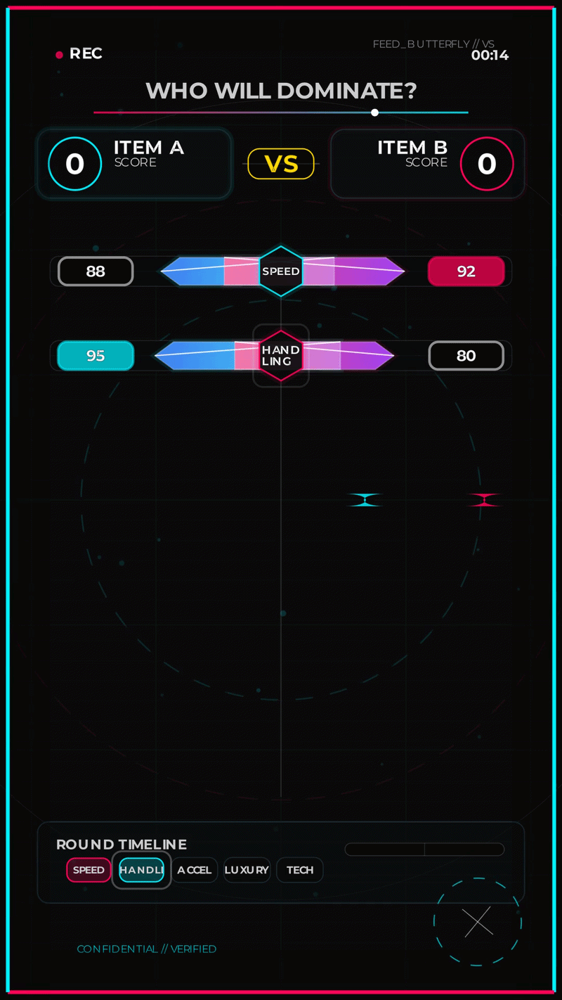
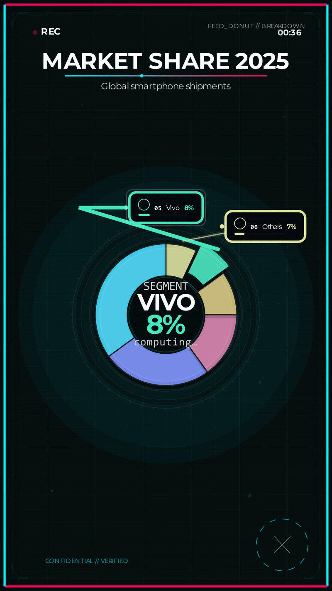
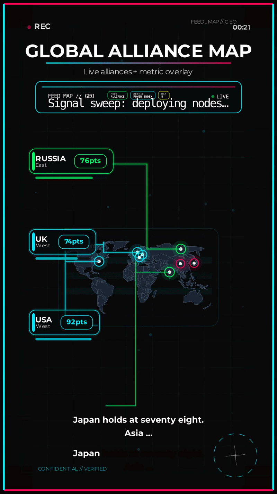
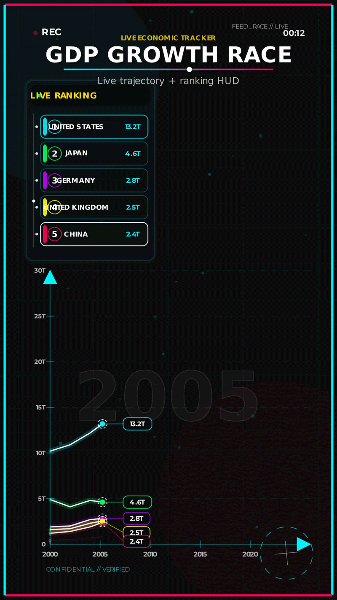

# AutoShorts: Automated AI Video Generation Pipeline

> **📝 Disclaimer:** *This is a proprietary personal project and is currently in active development. Therefore, this documentation serves as an architectural overview and technical case study of the pipeline, rather than an open-source installation guide.*

An end-to-end pipeline that autonomously handles everything from scraping raw data from the internet to rendering a 60-second, high-retention 3D motion graphics video. This is not a generic AI wrapper; it is a system designed purely for **Zero Hallucination** and **Absolute Frame-Sync Control**.

---

### **Tech Stack**
- **Language:** Python 3.x (Asyncio, Pydantic)
- **AI/LLM:** Google Gemini 1.5, LangGraph (Agentic Routing)
- **Visual Engine:** Manim Community Engine (3D Mathematical Animations)
- **Audio:** ElevenLabs API, Pydub (In-memory processing)
- **Infrastructure:** FFmpeg (Complex Filter Chains), SHA-256 Hashing

---

### **The Core Philosophy**
Building AI videos in today's market is easy, but making them "Production-Grade" is difficult. I built this project with a **"Director's Mindset"**. Before writing a single line of code, the entire system was visualized and theoretically planned so that every pixel of the video and every millisecond of the audio syncs perfectly. 

The main goal of this pipeline is to achieve a combination of **Human-like execution** and **Machine-like precision**.

---

### **System Architecture (The 4-Phase Flow)**

My system operates in four decoupled phases, where each phase has its own isolation layer:

1.  **Phase 1: Discovery & Extraction (The Brain)**
    The agent scours the internet to discover trending topics and validates them based on an "Authority Ranking" (Bloomberg/UN > Social Media). Using Pydantic schemas, the raw data is strictly mapped and converted into a JSON format.

2.  **Phase 2: Scripting Engine (The Voice)**
    Here, the dataset is transformed into persona-driven scripts. I have **BANNED** LLMs from generating JSON so the structure never fails. The LLM only outputs a monologue wrapped in XML tags, which a Python parser then safely processes.

3.  **Phase 3: Audio Synthesis (The Synchronizer)**
    Audio is generated via the ElevenLabs API and trimmed directly in RAM using `pydub`. Here, an "Under-run Gate" logic checks whether the physical audio length matches the required visual timing constraints.

4.  **Phase 4: Video Engine (The Renderer)**
    The final payload is sent to the Manim Engine. This engine renders the video in a purely deterministic manner without any AI dependency, and adds dynamic background music (Sidechain Ducking) using FFmpeg.

---

### **Hardcore Engineering Challenges Solved**

Here are the core engineering problems I solved while building this pipeline:

- **The Sync Nightmare (Under-run Gate):** AI voice speed is unpredictable. I built a system that measures the physical length of the audio in milliseconds. If the audio falls short of the visual animation duration, the pipeline automatically triggers Phase 2 to rewrite the script. Result: 100% Frame-perfect sync.

- **Eliminating Hallucinations:** LLMs often hallucinate incorrect file paths or config structures. To prevent this, I utilized **Strict Python Assembly**. The LLM only provides text content, and my Python code safely assembles the configurations.

- **Crash-Resilience (Atomic State):** Crashes are normal in large-scale projects. I used `os.replace` and atomic file operations so that if the pipeline crashes mid-execution, data doesn't get corrupted and the system can resume exactly from where it left off.

- **Cost & Rate Limit Optimization:** Making redundant API calls wastes money. I implemented **SHA-256 Hash-based Caching**. If the inputs are identical, the system fetches the result from the cache. Additionally, I managed ElevenLabs' Rate Limits (HTTP 429) securely using `asyncio.Semaphore`.

---

### **Proof of Work: Visual Templates & Output Gallery**

To demonstrate the engine's rendering capabilities, here are some sample outputs serving as a **Proof of Work**. The system currently supports **7 complex, data-driven 3D templates** designed specifically for the 9:16 vertical short-form format. 

These templates are not static; they dynamically adjust typography, scale, and layout based on the raw dataset:

1. **VS Card:** Engineered for dynamic entity comparisons, adjusting layout based on text length and data magnitude.
2. **Bar Chart Race:** Handles time-series datasets, interpolating values smoothly across frames to show statistical growth trends without jitter.
3. **Scan Race:** A high-retention progress visualizer that maps percentage completions with scanning laser effects.
4. **Butterfly Chart:** A dual-axis comparative analysis tool, rendering symmetrical data points for opposing metrics.
5. **Geopolitics Grid:** Maps authority rankings and hierarchical data into a clean, structured visual grid.
6. **Case Study Timeline:** A chronological visualizer that smoothly transitions through historical data points or sequential events.
7. **Data Reveal:** A suspense-driven template that slowly unpacks complex statistics to maximize viewer retention.

Below is a snapshot of the engine in action (rendered entirely in RAM):

<table width="100%">
  <tr>
    <td width="50%" align="center">
       
      <b>1. VS Card</b> (Dynamic Comparison)
    </td>
    <td width="50%" align="center">
       
      <b>2. Bar Chart Race</b> (Statistical Trends)
    </td>
  </tr>
  
  <tr>
    <td width="50%" align="center">
       
      <b>3. Scan Race</b> (Progress Visuals)
    </td>
    <td width="50%" align="center">
       
      <b>4. Butterfly Chart</b> (Comparative Analysis)
    </td>
  </tr>
</table>

---
